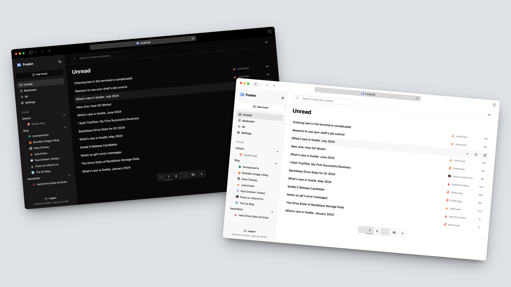

<h1 align="center">Fusion</h1>
<p align="center">A lightweight RSS feed aggregator and reader.</p>
<p align="center">
  <a href="https://news.ycombinator.com/item?id=40522244">
    
  </a>
</p>



## Features

- Feed organization with groups, unread tracking, bookmarks, and search
- RSS/Atom parsing with feed discovery support
- Responsive web UI with keyboard shortcuts and PWA support
- Self-hosting friendly: single binary or Docker deployment
- Internationalization (English, Chinese, German, French, Spanish, Russian, Portuguese, Swedish)

## Quick Start (Docker)

> `latest` is the latest release.
>
> `main` is the latest development build.

```shell
docker run -it -d -p 8080:8080 \
  -v $(pwd)/fusion:/data \
  -e FUSION_PASSWORD="fusion" \
  ghcr.io/0x2e/fusion:latest
```

Open `http://localhost:8080`.

Docker Compose example:

```yaml
version: "3"
services:
  fusion:
    image: ghcr.io/0x2e/fusion:latest
    ports:
      - "127.0.0.1:8080:8080"
    environment:
      - FUSION_PASSWORD=fusion
    restart: unless-stopped
    volumes:
      - ./data:/data
```

## Other Installation Options

- Pre-built binary: download from [Releases](https://github.com/0x2E/fusion/releases)
- Build from source: see [Contributing](./CONTRIBUTING.md)
- One-click deployment:
  - [Deploy on Fly.io](./fly.toml)
  - [Deploy on Railway](https://railway.com/template/XSPFK0?referralCode=milo) (community maintained)

## Configuration

All config keys are documented in [`.env.example`](./.env.example).

Common keys:

- `FUSION_DB_PATH` (default `fusion.db`)
- `FUSION_PASSWORD` (required unless `FUSION_ALLOW_EMPTY_PASSWORD=true`)
- `FUSION_PORT` (default `8080`)
- `FUSION_PULL_INTERVAL`, `FUSION_PULL_TIMEOUT`, `FUSION_PULL_CONCURRENCY`
- `FUSION_CORS_ALLOWED_ORIGINS`, `FUSION_TRUSTED_PROXIES`
- `FUSION_OIDC_*` for optional SSO

Legacy env names (`DB`, `PASSWORD`, `PORT`) are still accepted for backward compatibility.

## Documentation

- API contract (OpenAPI): [`docs/openapi.yaml`](./docs/openapi.yaml)
- Backend design: [`docs/backend-design.md`](./docs/backend-design.md)
- Frontend design: [`docs/frontend-design.md`](./docs/frontend-design.md)
- Legacy schema reference (kept for migration work): [`docs/old-database-schema.md`](./docs/old-database-schema.md)

## Development

- Requirements: Go `1.25+`, Node.js `24+`, pnpm
- Helpful commands are in [`scripts.sh`](./scripts.sh)

Example:

```shell
./scripts.sh build
```

## Contributing

Contributions are welcome. Please read [Contributing Guidelines](./CONTRIBUTING.md) before opening a PR.

## Credits

- Feed parsing powered by [gofeed](https://github.com/mmcdole/gofeed)
