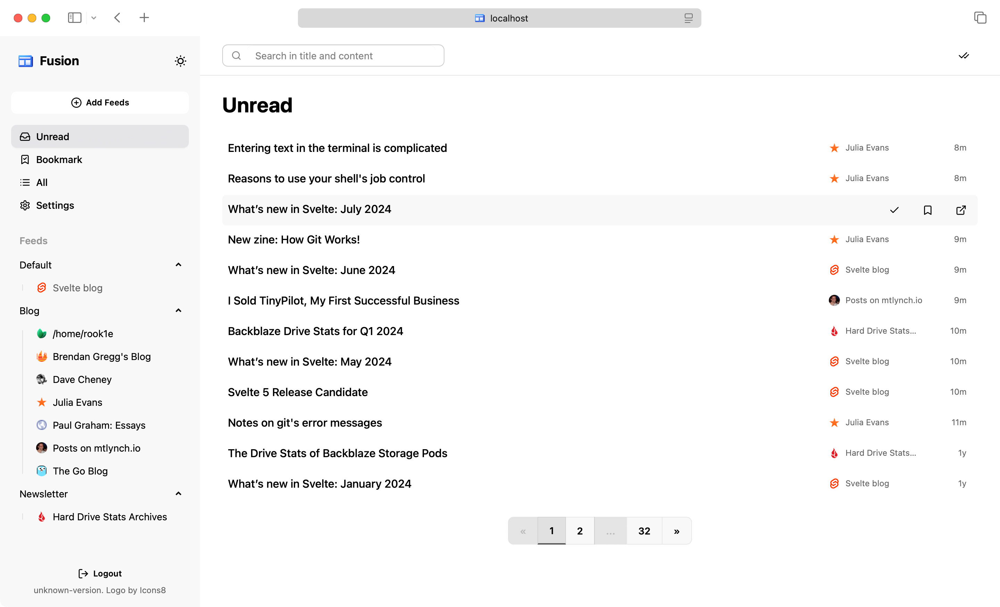
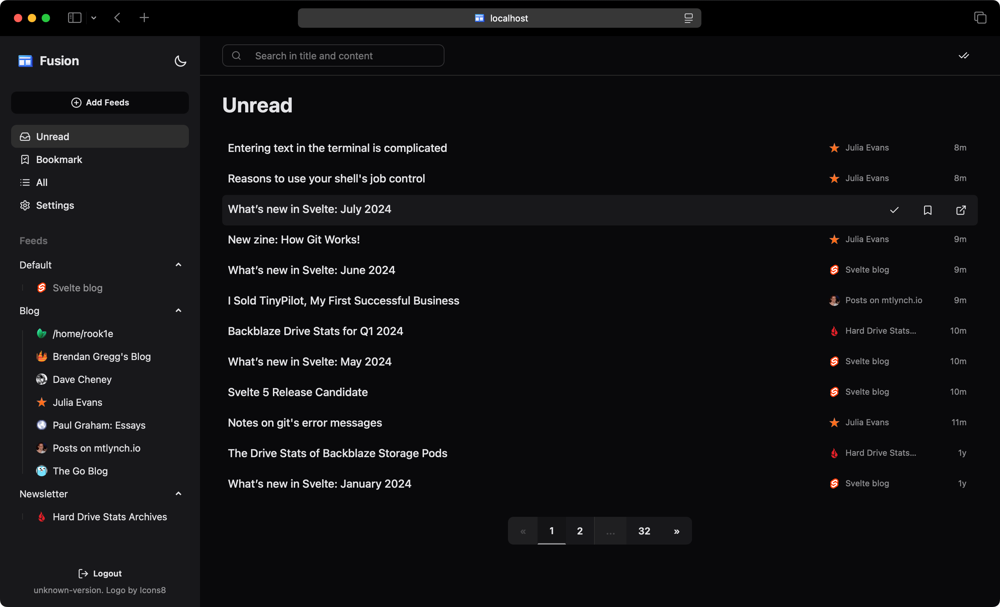

# Fusion

A lightweight RSS feed aggregator and reader.





Key features include:

- Group, bookmark, search, automatic feed sniffing, OPML file import/export
- Support for RSS, Atom, and JSON feed types
- Responsive, light/dark mode, PWA, Keyboard shortcut support
- Lightweight and self-hosted friendly
  - Built with Golang and SQLite, deploy with a single binary
  - Pre-built Docker image
  - Uses about 80MB of memory
- Internationalization (i18n): English, Chinese, German, French, Spanish, Russian, Portuguese, and Swedish

## Installation

### Docker

- Docker CLI

```shell
docker run -it -d -p 8080:8080 \
  -v $(pwd)/fusion:/data \
  -e PASSWORD="rss123456" \
  rook1e404/fusion:latest
```

- Docker Compose

```compose
version: '3'
services:
  fusion:
    image: rook1e404/fusion:latest
    ports:
      - '127.0.0.1:8080:8080'
    environment:
      - PASSWORD=rss123456
    restart: "unless-stopped"
    volumes:
      # Change `./data` to where you want the files stored
      - ./data:/data
```

### Pre-built binary

Download from [Releases](https://github.com/0x2E/fusion/releases).

### One-Click Deployment

[](https://zeabur.com/templates/7FRK0K?referralCode=rook1e404)

Maintained by community:

[](https://railway.com/template/XSPFK0?referralCode=milo)

### Build from source

Check out the Development section.

## Configuration

All configuration items can be found [here](./.env.example).

Fusion can be configured in many ways:

- System environment variables, such as those set by `export PASSWORD=123abc`.
- Create a `.env` file in the same directory as the binary. Note that values in `.env` file can be overwritten by system environment variables.

## Development

- Prepare environment: Go 1.24+, Node.js 23+ (and pnpm).
- Check out the commands in `scripts.sh`.

For example:

```shell
./scripts.sh build
```

## Credits

- Front-end is built with: [Sveltekit](https://github.com/sveltejs/kit), [daisyUI](https://github.com/saadeghi/daisyui)
- Back-end is built with: [Echo](https://github.com/labstack/echo), [GORM](https://github.com/go-gorm/gorm)
- Parsing feed with [gofeed](https://github.com/mmcdole/gofeed)
- Logo by [Icons8](https://icons8.com/icon/FeQbTvGTsiN5/news)
