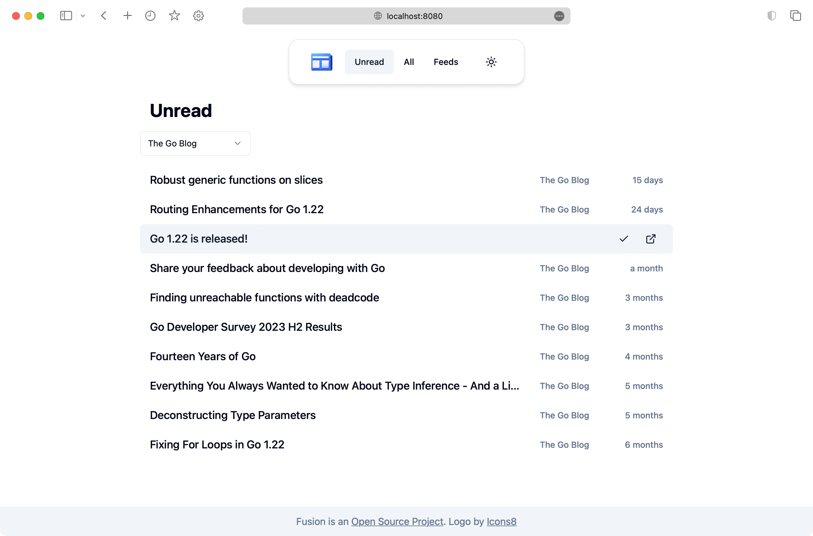

# Fusion

A lightweight RSS feed aggregator and reader.



Key features include:

- Group, Bookmark, Search, Sniff feeds automatically
- Import/Export OPML file
- Support RSS, Atom, JSON types feed
- Responsive, Light/Dark mode, PWA
- Lightweight, Self-hosted friendly
  - Built with Golang and SQLite, Deploy with a single binary
  - Pre-built Docker image
  - Uses about 80MB of memory

## Installation

### 1. Docker

Choose Docker CLI or Docker Compose examples below:

#### 1.a. Docker CLI

```shell
docker run -it -d -p 8080:8080 -v $(pwd)/fusion:/data \
      -e PASSWORD="rss123456" \
      rook1e404/fusion
```

#### 1.b. Docker Compose

```compose
version: '3'
services:
  fusion:
    image: rook1e404/fusion
    ports:
      - '127.0.0.1:8080:8080'
    environment:
      - PASSWORD=rss123456
    restart: "unless-stopped"
    volumes:
      - ./data:/data
```

Change `./data` to where you want the files stored. Remember to specify localhost IP unless you want Docker exposing the port though your firewall. Then, in the same directory as this `compose.yml` file run `docker compose up -d` (or `docker-compose up -d` on older versions).

### 2. Pre-built binary

Download from [Releases](https://github.com/0x2E/fusion/releases).

### 3. Build from source

1. Prepare dependencies: Go 1.22+, Node.js 21+.
2. Check `scripts.sh` for more details.

For example:

```shell
./scripts.sh build
```

## Configuration

Fusion can be configured in many ways:

- System environment variables, such as those set by `export PASSWORD=123abc`.
- Create a `.env` file in the same directory as the binary file, and then copy the items you want to modify into it.
  - NOTE: values in `.env` file can be overwritten by system environment variables.

All configuration items can be found [here](https://github.com/0x2E/fusion/blob/main/.env).

## Credits

- Front-end is built with: [Sveltekit](https://github.com/sveltejs/kit), [shadcn-svelte](https://github.com/huntabyte/shadcn-svelte)
- Back-end is built with: [Echo](https://github.com/labstack/echo), [GORM](https://github.com/go-gorm/gorm)
- Parsing feed with [gofeed](https://github.com/mmcdole/gofeed)
