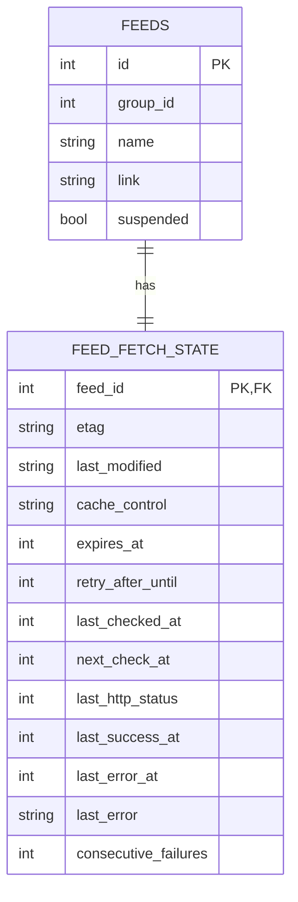
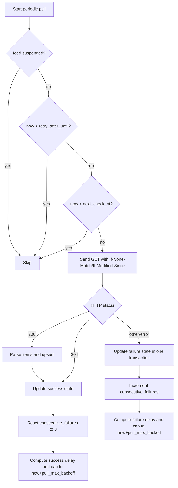

# ReedMe Backend Design

## 1. Goals

- Keep the backend small, easy to self-host, and easy to reason about.
- Prefer explicit SQL over ORM abstractions.
- Preserve user content via bookmark snapshots.

## 2. Runtime architecture

ReedMe backend runs two long-lived services in one process:

1. HTTP API server (Gin)
2. Feed pull worker (periodic and manual refresh)

Both services share the same SQLite store.

## 3. Tech stack

| Area           | Choice                                |
| -------------- | ------------------------------------- |
| Language       | Go 1.25                               |
| HTTP framework | Gin                                   |
| Database       | SQLite (`modernc.org/sqlite`)         |
| Migrations     | Embedded SQL files                    |
| Feed parser    | `github.com/mmcdole/gofeed`           |
| Feed discovery | `github.com/0x2E/feedfinder`          |
| Auth           | Password session auth + optional OIDC |

## 4. Module layout

```text
backend/
├── cmd/reedme/main.go           # process startup and lifecycle
├── internal/
│   ├── config/                  # env parsing
│   ├── handler/                 # HTTP handlers + middleware
│   ├── store/                   # SQL persistence + migrations
│   ├── pull/                    # fetch/parse/schedule/backoff
│   ├── pullpolicy/              # pure pull scheduling policy
│   ├── auth/                    # password + OIDC helpers
│   ├── model/                   # API/storage models
│   └── pkg/httpc/               # HTTP client + SSRF guards
```

## 5. Database schema (current)

Source of truth:

- `backend/internal/store/migrations/001_initial.sql`
- `backend/internal/store/migrations/002_feed_fetch_state.sql`

Legacy compatibility: when an old pre-`schema_migrations` database is detected,
backend first creates a timestamped `.bak` backup, builds a fresh temporary
database with the current schema, imports legacy `groups/feeds/items` data,
atomically swaps files, then records baseline version `1`.

### groups

- `id`, `name`, `created_at`, `updated_at`
- `name` is unique
- Default group: `id=1`, `name='Default'`

### feeds

- Core: `id`, `group_id`, `name`, `link`, `site_url`
- Runtime control: `suspended`
- Network: `proxy`
- Meta: `created_at`, `updated_at`
- Unique: `link`

### feed_fetch_state

- Per-feed runtime fetch state keyed by `feed_id`
- Conditional request metadata: `etag`, `last_modified`
- HTTP cache hints: `cache_control`, `expires_at`, `retry_after_until`
- Scheduler state: `last_checked_at`, `next_check_at`
- Outcome state: `last_http_status`, `last_success_at`, `last_error_at`, `last_error`, `consecutive_failures`
- `feed_id` references `feeds(id)` with `ON DELETE CASCADE`
- API shape: runtime fields are exposed under `feed.fetch_state.*`.

### Feed runtime state map



### items

- `id`, `feed_id`, `guid`, `title`, `link`, `content`, `pub_date`, `unread`, `created_at`
- Unique: `(feed_id, guid)`
- Indexes: unread partial index, `pub_date` index, `(feed_id, unread)` index

### items full-text search

- Virtual table: `items_fts` (FTS5 on `title`, `content`)
- Triggers keep `items_fts` synchronized with `items`

### bookmarks

- Snapshot table: `item_id`, `link`, `title`, `content`, `pub_date`, `feed_name`, `created_at`
- `link` is unique
- `item_id` is nullable to preserve snapshots after source item deletion

## 6. Data integrity and cascade strategy

- Cascade rules are explicit in store transactions for group/feed/item/bookmark lifecycles:
  - Delete group: move feeds to group `1`, then delete group.
  - Delete feed: set matching bookmarks `item_id=NULL`, delete items, then delete feed.
- `feed_fetch_state` uses a direct foreign key to `feeds(id)` for guaranteed runtime-state cleanup.

This keeps behavior explicit and avoids hidden DB-level side effects.

## 7. API surface (high level)

- Sessions: login/logout
- OIDC: enabled status, login URL, callback
- Groups: list/get/create/update/delete
- Feeds: list/get/create/update/delete/validate/batch create/refresh
- Items: list/get/mark read/mark unread
- Search: feed + item search
- Bookmarks: list/get/create/delete

Detailed contract: `docs/openapi.yaml`.

### Breaking API change (feed runtime fields)

- Feed runtime pull fields moved from top-level `feed.*` to nested `feed.fetch_state.*`.
- Removed top-level fields: `last_build`, `last_failure_at`, `failure`, `failures`.
- Clients that still decode old fields must update to `fetch_state` before upgrading.

## 8. Feed pull strategy

### Scheduler

- Pull interval: `REEDME_PULL_INTERVAL` (default `1800s`)
- Concurrency limit: `REEDME_PULL_CONCURRENCY` (default `10`)
- Request timeout: `REEDME_PULL_TIMEOUT` (default `30s`)
- Global max scheduling delay: `REEDME_PULL_MAX_BACKOFF` (default `48h`)

### Next-check bound

- `next_check_at` is always computed from branch delay, then capped by `REEDME_PULL_MAX_BACKOFF`.
- Success branch (`200/304`):
  - `success_delay = max(interval, retry_after_delay, freshness_delay)`
  - `freshness_delay` comes from `Cache-Control max-age` and/or `Expires`.
- Failure branch:
  - `failure_delay = max(interval, retry_after_delay, backoff_delay)`
- Final rule (both branches):
  - `next_check_at = now + min(branch_delay, pull_max_backoff)`
- `suspended` remains an explicit skip switch and is not affected by this cap.

### Skip policy

Periodic pull skips feed when:

- Feed is suspended, or
- Current time is before `retry_after_until`, or
- Current time is before `next_check_at`.

### Backoff

- Formula: `interval * (1.8 ^ failures)`
- `failures` here is the updated `consecutive_failures` value after the current failure is recorded.
- `backoff_delay` is capped by `REEDME_PULL_MAX_BACKOFF`.
- Failure branch computes `next_check_at` from the strictest delay source:
  - pull interval
  - `Retry-After`
  - exponential backoff
- Final `next_check_at` (success/failure) uses the same `REEDME_PULL_MAX_BACKOFF` cap.
- Failure counter and `next_check_at` are updated in one DB transaction to avoid stale-counter races during concurrent refresh failures.
- Failure updates do not overwrite `cache_control` / `expires_at`; these freshness fields are only refreshed on successful `200/304` checks.

### Conditional requests

- Request headers: `If-None-Match` (from `etag`) and `If-Modified-Since` (from `last_modified`)
- Response handling:
  - `200`: parse items and refresh validators/cache metadata
  - `304`: treat as successful check without item parsing
- If a `304` response omits validators or cache headers, previous stored values are kept.

### Pull decision flow



### Manual refresh

- `POST /feeds/refresh`: refresh all non-suspended feeds
- `POST /feeds/:id/refresh`: refresh one feed
- Manual refresh bypasses periodic skip logic

## 9. Security model

- Password auth with bcrypt hash computed at startup
- Login attempt rate limit (`REEDME_LOGIN_*`)
- Session cookie: `HttpOnly`, `SameSite=Lax`, `Secure` on HTTPS
- Optional OIDC SSO (`REEDME_OIDC_*`)
- URL validation + private-network blocking by default for feed fetches
- CORS allowlist via `REEDME_CORS_ALLOWED_ORIGINS`
- Trusted proxy list via `REEDME_TRUSTED_PROXIES`

## 10. Observability and logs

- Structured logging via `log/slog`
- Configurable log level (`REEDME_LOG_LEVEL`)
- Configurable output format (`REEDME_LOG_FORMAT`: `auto`, `text`, `json`)

## 11. Release verification checklist

- Backend tests: `cd backend && go test ./...`
- Build check: `cd backend && go build -o /dev/null ./cmd/reedme`
- Migration sanity check: start app on empty DB and ensure schema bootstraps correctly
- API smoke tests: login, create feed, manual refresh, search, bookmark create/delete
