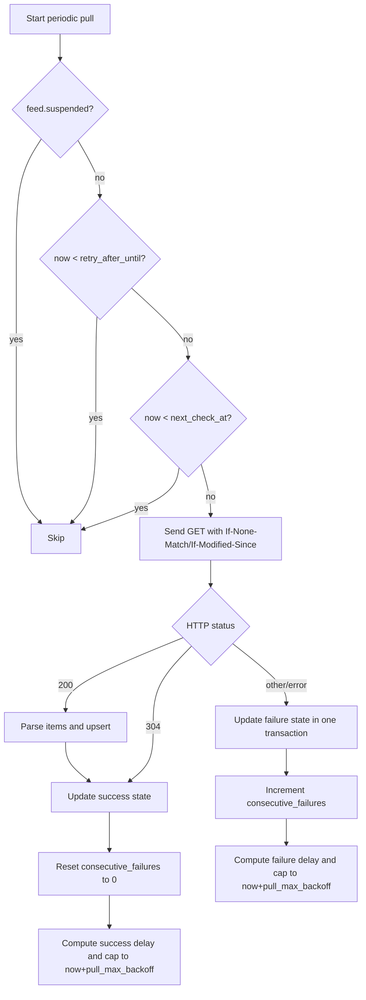

# Fusion Backend Design

## 1. Goals

- Keep the backend small, easy to self-host, and easy to reason about.
- Prefer explicit SQL over ORM abstractions.
- Preserve user content via bookmark snapshots.

## 2. Runtime architecture

Fusion backend runs two long-lived services in one process:

1. HTTP API server (Gin)
2. Feed pull worker (periodic and manual refresh)

Both services share the same SQLite store.

## 3. Stack decisions

Dependencies live in `backend/go.mod` — do not restate them here. The
choices that are not obvious from the file list:

- Pure-Go SQLite driver (`modernc.org/sqlite`) so releases are
  `CGO_ENABLED=0` static binaries (see `scripts.sh`).
- Explicit SQL with named parameters, no ORM.
- Feed scheduling math is a pure package (`pullpolicy`) so it can be
  tested without a store or clock.

## 4. Module layout

Directory structure mirrors `backend/` on disk — browse it directly. The
responsibilities worth knowing that names do not convey: `pull` owns
fetch/parse/backoff orchestration while `pullpolicy` is the pure
decision logic; `internal/pkg/httpc` is the outbound HTTP client with
SSRF guards (private-network blocking) built in; `store` embeds and
applies the SQL migrations.

## 5. Database schema (current)

Source of truth: `backend/internal/store/migrations/` (applied in numeric
order; each file's comments carry the rationale for that change). The list
below names tables and their role only — do not maintain a field inventory
here, it duplicates the migrations and rots.

- `groups` — unique `name`; default group is `id=1`.
- `feeds` — unique `link`; `group_id` association.
- `feed_fetch_state` — per-feed runtime pull state, 1:1 with `feeds` via
  `feed_id` (`ON DELETE CASCADE`); exposed through the API as
  `feed.fetch_state.*`.
- `items` — unique `(feed_id, guid)`; unread partial index, `pub_date` and
  `(feed_id, unread)` indexes.
- `items_fts` — FTS5 virtual table (`title`, `content`), kept in sync with
  `items` by triggers.
- `bookmarks` — content snapshots; `link` unique; `item_id` and `feed_id`
  are nullable soft associations, so snapshots survive source deletions
  (see migrations 001 and 003 for the rationale).
- `settings` — single row (`id = 1`); nullable preference columns where
  `NULL` means "never explicitly chosen"; validation lives in the handler,
  not SQL `CHECK`s (rationale in migration 004).

Legacy compatibility: when an old pre-`schema_migrations` database is
detected, backend first creates a timestamped `.bak` backup, builds a fresh
temporary database with the current schema, imports legacy `groups/feeds/items` data,
atomically swaps files, then records baseline version `1`.

## 6. Data integrity and cascade strategy

- Group/feed/item lifecycles use explicit store transactions:
  - Delete group: move feeds to group `1`, then delete group.
  - Delete feed: set matching bookmarks `item_id=NULL`, delete items, then delete feed.
- The declared foreign-key `ON DELETE` actions are the safety net around
  those transactions: `feeds.group_id` RESTRICT (a non-empty group cannot
  be deleted at the DB level; the app moves feeds away first, so this
  never fires in practice), `items.feed_id` CASCADE (redundant with the
  explicit delete path but guarantees no orphaned items),
  `feed_fetch_state.feed_id` CASCADE (runtime state must not outlive its
  feed), and `bookmarks.item_id` / `bookmarks.feed_id` SET NULL (snapshot
  content must survive source deletions).

## 7. API surface

The endpoint inventory is the route registration in
`internal/handler/handler.go` (`SetupRouter`); cross-cutting conventions
(envelopes, cursors, errors, status codes) are in `docs/api-conventions.md`.
This section only records history.

### Breaking API change (feed runtime fields)

- Feed runtime pull fields moved from top-level `feed.*` to nested `feed.fetch_state.*`.
- Removed top-level fields: `last_build`, `last_failure_at`, `failure`, `failures`.
- Clients that still decode old fields must update to `fetch_state` before upgrading.

## 8. Feed pull strategy

### Scheduler

Tuning knobs (`FUSION_PULL_INTERVAL`, `FUSION_PULL_CONCURRENCY`,
`FUSION_PULL_TIMEOUT`, `FUSION_PULL_MAX_BACKOFF`) and their defaults are
listed in [`.env.example`](../.env.example) — the behavioral rules below
are what the knobs mean.

### Next-check bound

- `next_check_at` is always computed from branch delay, then capped by `FUSION_PULL_MAX_BACKOFF`.
- Success branch (`200/304`):
  - `success_delay = max(interval, retry_after_delay, freshness_delay)`
  - `freshness_delay` comes from `Cache-Control max-age` and/or `Expires`.
- Failure branch:
  - `failure_delay = max(interval, retry_after_delay, backoff_delay)`
- Final rule (both branches):
  - `next_check_at = now + min(branch_delay, pull_max_backoff)`
- `suspended` remains an explicit skip switch and is not affected by this cap.

### Skip policy

Periodic pull skips feed when:

- Feed is suspended, or
- Current time is before `retry_after_until`, or
- Current time is before `next_check_at`.

### Backoff

- Formula: `interval * (1.8 ^ failures)`
- `failures` here is the updated `consecutive_failures` value after the current failure is recorded.
- `backoff_delay` is capped by `FUSION_PULL_MAX_BACKOFF`.
- Failure branch computes `next_check_at` from the strictest delay source:
  - pull interval
  - `Retry-After`
  - exponential backoff
- Final `next_check_at` (success/failure) uses the same `FUSION_PULL_MAX_BACKOFF` cap.
- Failure counter and `next_check_at` are updated in one DB transaction to avoid stale-counter races during concurrent refresh failures.
- Failure updates do not overwrite `cache_control` / `expires_at`; these freshness fields are only refreshed on successful `200/304` checks.

### Conditional requests

- Request headers: `If-None-Match` (from `etag`) and `If-Modified-Since` (from `last_modified`)
- Response handling:
  - `200`: parse items and refresh validators/cache metadata
  - `304`: treat as successful check without item parsing
- If a `304` response omits validators or cache headers, previous stored values are kept.

### Pull decision flow

```mermaid
flowchart TD
    A[Start periodic pull] --> B{feed.suspended?}
    B -- yes --> Z[Skip]
    B -- no --> C{now < retry_after_until?}
    C -- yes --> Z
    C -- no --> D{now < next_check_at?}
    D -- yes --> Z
    D -- no --> E[Send GET with If-None-Match/If-Modified-Since]

    E --> F{HTTP status}
    F -- 200 --> G[Parse items and upsert]
    G --> H[Update success state]
    F -- 304 --> H
    F -- other/error --> I[Update failure state in one transaction]

    H --> J[Reset consecutive_failures to 0]
    J --> K[Compute success delay and cap to now+pull_max_backoff]
    I --> L[Increment consecutive_failures]
    L --> M[Compute failure delay and cap to now+pull_max_backoff]
```

### Manual refresh

- `POST /feeds/refresh`: refresh all non-suspended feeds
- `POST /feeds/:id/refresh`: refresh one feed
- Manual refresh bypasses periodic skip logic

## 9. Security model

- Password auth with bcrypt hash computed at startup
- Login attempt rate limit (`FUSION_LOGIN_*`)
- Session cookie: `HttpOnly`, `SameSite=Lax`, `Secure` on HTTPS
- Optional OIDC SSO (`FUSION_OIDC_*`)
- URL validation + private-network blocking by default for feed fetches
- CORS allowlist via `FUSION_CORS_ALLOWED_ORIGINS`
- Trusted proxy list via `FUSION_TRUSTED_PROXIES`

Logging is structured (`log/slog`) with level and format controlled by
`FUSION_LOG_LEVEL` / `FUSION_LOG_FORMAT`; the full environment variable
reference is [`.env.example`](../.env.example).

## 10. Release verification

The standard checklist is [CONTRIBUTING.md](../CONTRIBUTING.md) (or
`./scripts.sh test`). Release-only extras:

- Migration sanity check: start the app on an empty DB and confirm the
  schema bootstraps.
- API smoke pass: login, create feed, manual refresh, search, bookmark
  create/delete.
